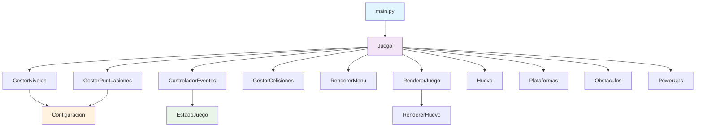

# Huevos a la Fuga - Version 2.0 Modular

Un emocionante juego de plataformas desarrollado en Python con Pygame donde controlas un huevo que debe escapar de los peligros de la cocina.

## 🎮 Características del Juego

- **3 Niveles Únicos**: Cocina Inicial, Zona de Cocción y Gran Escape
- **Física Realista**: Gravedad, saltos y colisiones
- **Sistema de Power-ups**: Cáscara protectora, papel higiénico y turbo
- **Sistema de Puntuaciones**: Guarda y muestra los mejores tiempos
- **Interfaz Completa**: Menús, pausa, game over y victoria
- **Huevo Sonriente**: Personaje principal con cara feliz

## 🏗️ Estructura del Proyecto (Modular)

```
HuevosalaFuga_ProyectoPOO/
├── main.py                      # Punto de entrada principal
├── config/                      # Configuración del juego
│   ├── __init__.py
│   └── configuracion.py         # Constantes y configuraciones
├── src/                         # Código fuente principal
│   ├── __init__.py
│   ├── juego.py                 # Clase principal del juego
│   ├── logica/                  # Módulos de lógica
│   │   ├── __init__.py
│   │   ├── gestor_niveles.py    # Carga y gestión de niveles
│   │   ├── gestor_puntuaciones.py  # Sistema de puntuaciones
│   │   ├── controlador_eventos.py  # Manejo de eventos
│   │   └── gestor_colisiones.py # Sistema de colisiones
│   └── renderizado/             # Módulos de renderizado
│       ├── __init__.py
│       ├── renderer_huevo.py    # Renderizado del huevo
│       ├── renderer_menu.py     # Renderizado de menús
│       └── renderer_juego.py    # Renderizado del juego
├── model/                       # Modelos del juego (POO)
│   ├── objetos_juego/          # Objetos del juego
│   │   ├── __init__.py
│   │   ├── huevo.py            # Clase del huevo
│   │   ├── plataforma.py       # Clase de plataformas
│   │   ├── obstaculo.py        # Clase de obstáculos
│   │   └── powerup.py          # Clase de power-ups
│   └── estados.py              # Estados del juego (enum)
├── data/                       # Archivos de datos
│   ├── .gitkeep
│   └── puntuaciones.json       # Puntuaciones guardadas (generado)
├── docs/                       # Documentación
│   ├── diagrama_clases_uml.md  # Diagrama UML en Mermaid
│   └── diagrama_clases_plantuml.puml  # Diagrama UML en PlantUML
└── README.md                   # Esta documentación
```

## 📐 Diagrama de Clases UML

El proyecto implementa una arquitectura modular bien estructurada. Puedes encontrar los diagramas UML completos en:

- **Mermaid**: [`docs/diagrama_clases_uml.md`](docs/diagrama_clases_uml.md)
- **PlantUML**: [`docs/diagrama_clases_plantuml.puml`](docs/diagrama_clases_plantuml.puml)

### Resumen de la Arquitectura



### Principales Componentes

- **🎮 Juego**: Clase principal que coordina todos los módulos (Patrón Façade)
- **🎯 Gestores**: Clases utilitarias para lógica específica (niveles, puntuaciones, colisiones, eventos)
- **🎨 Renderizadores**: Módulos especializados para dibujar elementos
- **🧩 Objetos**: Clases del modelo de juego (Huevo, Plataforma, Obstáculo, PowerUp)
- **⚙️ Configuración**: Constantes centralizadas
- **📊 Estados**: Enumeración de estados del juego

## 🎯 Controles

- **ESPACIO / FLECHA ARRIBA**: Saltar
- **A / FLECHA IZQUIERDA**: Mover izquierda
- **D / FLECHA DERECHA**: Mover derecha
- **ENTER**: Iniciar juego / Reiniciar
- **P**: Ver puntuaciones (en menú)
- **ESC**: Pausar / Continuar
- **Q**: Salir al menú (desde pausa)

## 🚀 Instalación y Ejecución

### Requisitos
- Python 3.7+
- Pygame

### Instalación
```bash
pip install pygame
```

### Ejecución
```bash
python main.py
```

## 🎨 Características Técnicas

### Arquitectura Modular
- **Separación de responsabilidades**: Cada módulo tiene una función específica
- **Configuración centralizada**: Todas las constantes en un solo archivo
- **Renderizado separado**: Módulos especializados para diferentes elementos
- **Gestión de eventos**: Controlador dedicado para entrada del usuario
- **Sistema de colisiones**: Lógica separada para detección y respuesta

### Mejoras de la Version 2.0
- ✅ **Código modularizado** en paquetes especializados
- ✅ **Configuración centralizada** en `config/configuracion.py`
- ✅ **Separación de renderizado** por responsabilidades
- ✅ **Gestores especializados** para niveles, puntuaciones y colisiones
- ✅ **Clase principal de juego** que coordina todos los módulos
- ✅ **Documentación completa** del proyecto
- ✅ **Estructura escalable** para futuras mejoras
- ✅ **Diagrama UML completo** documentando la arquitectura

### Física del Juego
- **Fuerza de salto**: -15 píxeles
- **Gravedad**: 0.4 píxeles/frame
- **Velocidad de movimiento**: 5 píxeles/frame
- **Sistema de grietas**: Máximo 3 antes de game over
- **Invulnerabilidad temporal** tras recibir daño

### Power-ups
- **Cáscara** (Verde): Protección contra un golpe
- **Papel** (Blanco): Invulnerabilidad temporal extendida
- **Turbo** (Amarillo): Velocidad de movimiento aumentada

## 🏆 Sistema de Puntuaciones

Las puntuaciones se guardan automáticamente en `data/puntuaciones.json` y se ordenan por menor tiempo (mejor puntuación). El archivo se crea automáticamente si no existe.

## 🐛 Desarrollo y Contribución

### Agregar un Nuevo Nivel
1. Modifica `src/logica/gestor_niveles.py`
2. Crea un método `_cargar_nivel_X()` 
3. Actualiza `MAX_NIVEL` en `config/configuracion.py`

### Agregar un Nuevo Power-up
1. Modifica `model/objetos_juego/powerup.py`
2. Agrega el tipo en el método `aplicar()`
3. Actualiza los colores si es necesario

### Personalizar Física
Modifica las constantes en `config/configuracion.py`:
- `FUERZA_SALTO`: Altura del salto
- `GRAVEDAD`: Velocidad de caída
- `VELOCIDAD_MOVIMIENTO`: Velocidad horizontal

## 📄 Licencia

Proyecto educativo desarrollado como ejemplo de programación orientada a objetos y arquitectura modular en Python.